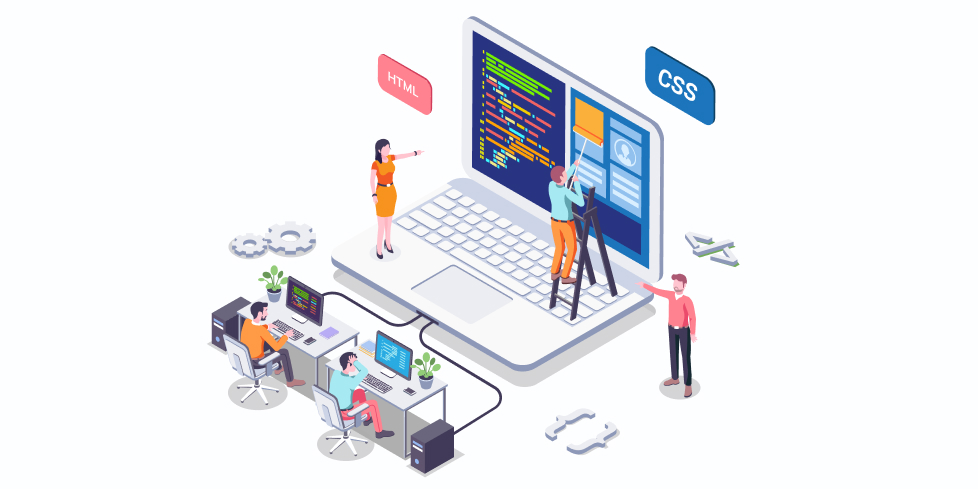

<h2 align="center">Привет, меня зовут Олег, я front-end разработчик</h2>

### 👨🏻‍💻 &nbsp;Обо мне

💡 &nbsp;Занимаюсь версткой сайтов с чистым, кроссбраузерным, валидным кодом. Адаптивная верстка. HTML5, CSS3, JavaScript, jQuery, cms WordPress.

💡 &nbsp;Помимо совершенствования своих навыков в верстке сайтов стараюсь углубить свои знания в JavaScript и PHP.
***

### 🛠 &nbsp;Технический стек
<!-- &nbsp;
&nbsp;
&nbsp;
&nbsp;
&nbsp;

&nbsp;

&nbsp;
&nbsp;
&nbsp; -->

***

### 🤝🏻 &nbsp;Связь

***

### Сайт портфолио

***

### ⚙️ &nbsp;GitHub Analytics

<<<<<<< HEAD

=======

>>>>>>> 30f1e69870ddeff5899f3d914f8046144a203fb3
